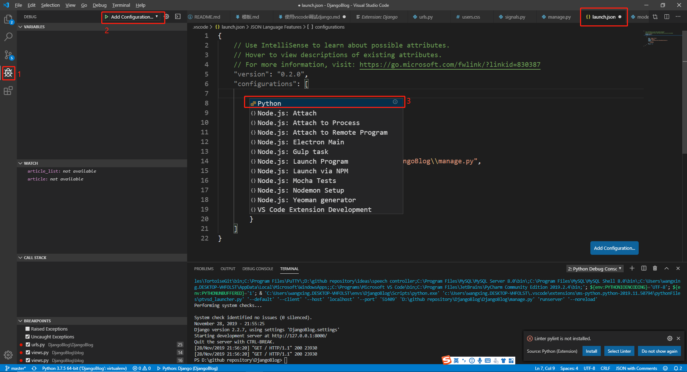
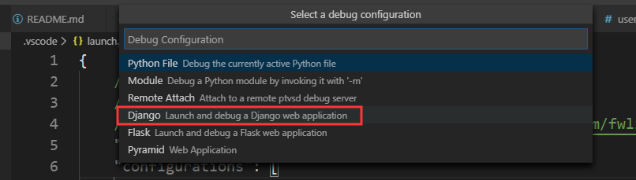
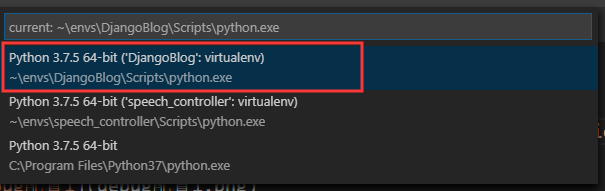

1. 安装django插件

2. 打开manage.py后，点击`debug按钮`（1），点击`Add configuration`按钮后，打开debug配置文件launch.json，选择`python`选项

3. 选择`django`选项

4. 设置vscode的python解释器使用虚拟环境的   
>1. `Ctrl+Shift+P`
>2. 选择`Python: Select Interpreter`选项
>3. 选择虚拟环境的python解释器

5. 在views.py中设置断点，开始调试。
